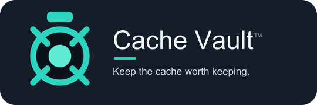

<p align="center">
  
</p>

# Cache Vault by The Proof Foundry™

> Proof-first software forged for builders.

**Cache Vault by The Proof Foundry™** is a modern clipboard vault.
Capture everything. Auto-organize it. Save what matters. Export with receipts.

It is a **local-first** Windows clipboard vault. It saves what you copy,
classifies it with smart filters (links, code, commands, paths, emails,
sensitive secrets), and lets you search, favorite, and organize clips — with
**Export / Save As**, **Proof Manifests**, and **Stamped Receipts** when you
need evidence, not promises.

Cache Vault does not pretend to be magic. No cloud account. No subscription.
Local-first, user-control-first, reversible before risky.

## Download / verify release

Download the packaged Windows build from the [latest GitHub
Release](https://github.com/Z3r0DayZion-install/cache-vault-landing/releases/latest).

After downloading the release zip, compute its SHA256 hash in PowerShell:

```powershell
Get-FileHash .\CacheVault-*.zip -Algorithm SHA256
```

Compare the reported hash against `SHA256SUMS.txt` from the same release. If
the values match, the archive matches the published release artifact.

## Brand assets

The primary mark is a clean teal vault dial — a rim, four symmetric handle
spokes, and a simple hub — on a dark rounded tile. It reads at 16–256 px. The
gold-coin "cash edition" is an alternate marketing variant only and is **never**
used for the app, tray, exe, or README header.

| File | Use |
|------|-----|
| `assets/cache-vault-icon.svg` | primary icon, source of truth |
| `assets/cache-vault-icon-{16,24,32,48,128,256}.png` | raster sizes |
| `assets/cache-vault-icon.ico` | multi-size Windows icon (window + tray + exe) |
| `assets/cache-vault-lockup.svg` / `.png` | icon + wordmark + tagline banner |
| `assets/variants/cache-vault-cash-edition.svg` / `.png` | alternate variant only |

SVG is the source of truth. Regenerate the rasters and verify them with:

```powershell
pip install svglib reportlab pillow
python tools\build_assets.py     # SVG -> PNGs + multi-size ICO
python tools\verify_assets.py    # checks files, ICO sizes, no-gold gate; contact sheet
```

## Trust doctrine

- **Local-first by default.** Everything lives in a local SQLite database.
- **No cloud account. No subscription. No ads, no telemetry.**
- Optional LAN bridge is **off by default** and never connects to the internet.
- **Sensitive clips are masked and auto-expire** (default ON, 10 minutes).
- Clipboard contents are **never written to logs or printed to the console**.

## Install & run

```powershell
# from the repo root
python -m venv .venv
.\.venv\Scripts\Activate.ps1
pip install -r requirements.txt
python app.py
```

Headless sanity check (no window — used by CI):

```powershell
python app.py --selftest
```

### Build a standalone .exe

```powershell
pwsh packaging\build_exe.ps1     # -> dist\CacheVault.exe (one-file, windowed)
```

The build bundles CustomTkinter's theme assets. Verify the build headlessly
with `dist\CacheVault.exe --selftest`. The packaged exe also stamps Windows
file/product metadata from the source version; verify it with
`python tools\verify_exe_metadata.py --exe dist\CacheVault.exe`.

## First run

Cache Vault runs as a tray app. The teal tray icon shows the app is running.
Closing the window hides it to the tray; use the tray menu's **Quit** action
to stop capture, remove the tray icon, and exit cleanly.

Local app data stays under `%LOCALAPPDATA%\CacheVault\`:

| What       | Path                                      |
|------------|-------------------------------------------|
| Database   | `%LOCALAPPDATA%\CacheVault\cache_vault.db` |
| Settings   | `%LOCALAPPDATA%\CacheVault\settings.json`  |

The global quick-paste hotkey defaults to `Ctrl+Shift+V`. Settings can also
enable **Start Cache Vault with Windows** through the per-user
`HKCU\Software\Microsoft\Windows\CurrentVersion\Run` key.

### Start with Windows

Settings → **Start Cache Vault with Windows** adds a per-user
`HKCU\…\CurrentVersion\Run` entry (no admin rights, fully reversible). For a
dev checkout it launches `pythonw app.py`; for a packaged build it launches the
exe directly.

### Organize & export

See [docs/FEATURE_DIRECTION.md](docs/FEATURE_DIRECTION.md) for the full product
direction (History, Favorites, Collections, Recently Removed, Export).

Right-click any clip for **Copy Again**, **Add/Remove Favorites**, **Move to
Collection…**, **Export / Save As…**, **Open** / **Reveal in Explorer** (local
path clips only), and **Remove from History**. Sidebar sections: All Clips,
Favorites, Collections (virtual app folders — one DB, not separate vaults), and
Recently Removed (Restore or Permanently Remove).

Export a single clip as `.txt` / `.md` / `.html` / `.json`, or a whole view /
collection as an organized folder or zip (`index.html`, `manifest.json` as
**Proof Manifest**, `stamped_receipt.txt`, `clips/`). Path clips export a
**reference + metadata only** by default; real files are copied into `files/`
only if you tick *Include file copies*, and originals are never moved or deleted.

*If it matters, keep the receipt.*

Settings → **History limit** prunes oldest non-favorite clips to Recently
Removed when exceeded (`0` = unlimited). Favorites always survive pruning.

## Tests

The core logic has **no GUI dependency** and is fully unit-tested:

```powershell
pip install -r requirements-dev.txt
python -m pytest
```

## Where data lives

| What       | Path                                              |
|------------|---------------------------------------------------|
| Database   | `%LOCALAPPDATA%\CacheVault\cache_vault.db`         |
| Settings   | `%LOCALAPPDATA%\CacheVault\settings.json`          |

## How it works

```
cache_vault/
  core/                 # pure-Python, unit-tested, no UI imports
    models.py           # Clip record + shared constants/helpers
    classify.py         # rule-based smart classifiers (no AI)
    sensitive.py        # secret detection, masking, expiry math
    storage.py          # SQLite repository (clips + filters + counts)
    events.py           # local event log (capture/pin/expire/…)
    search.py           # search-box syntax parser
    settings.py         # local JSON settings
    clipboard.py        # Windows clipboard monitor (event-based or polling)
    hotkey.py           # global RegisterHotKey listener + paste helper
    startup.py          # optional "start with Windows" (HKCU Run key)
    vault.py            # orchestration the UI/tray talk to
  ui/                   # CustomTkinter desktop shell + tray
    shell.py filters.py clip_list.py preview.py dialogs.py tray.py
    quick_paste.py      # global-hotkey quick-paste picker
    toast.py            # self-dismissing paste confirmation
packaging/              # PyInstaller spec + build script
app.py                  # entry point (+ --selftest)
tests/                  # pytest suite for the core
```

### Smart filters

Rule-based, no AI. Each clip gets one primary type plus tags:

- **Links** — `http(s)://` and conservative bare domains.
- **Files / Paths** — `C:\…`, `D:\…`, UNC `\\server\share`, quoted paths.
- **Code** — keywords / braces / multi-line indentation heuristics.
- **Commands** — leading `git`, `python`, `npm`, `winget`, `docker`, … (a
  `git clone https://…` is a **command**, not a link).
- **Emails / Phone numbers** — conservative regex to avoid over-detecting.
- **Sensitive** — API keys, tokens, JWTs, private keys, credit-card numbers
  (Luhn-checked), recovery/one-time codes, and high-entropy secrets.

### Search syntax

```
type:link github      type:code python      source:cursor
sensitive:true         pinned:true            <free text>
```

Unknown `key:value` tokens fall back to free-text search.

### Sensitive handling

Sensitive clips get a **masked preview**, an explicit **Reveal** action, an
**auto-expiry timer**, and a one-click **Clear Sensitive Clips**. On expiry the
secret content is scrubbed from the database; the row survives only as an
*Expired* entry and an event-log line — **the event log never stores the
secret**.

### Tray

One tray icon. Menu: **Open Cache Vault · Pause Capture · Resume Capture ·
Clear Sensitive Clips · Quit**. Closing the window hides to the tray; **Quit**
stops the monitor, removes the icon, and terminates cleanly.

### Quick paste (global hotkey)

Press **`Ctrl+Shift+V`** anywhere (Win+V is reserved by Windows) to pop up a
quick picker of your most recent clips, no matter which app is focused:

- `↑` / `↓` move the selection, `1`–`9` jump straight to a row
- `Enter` pastes the highlighted clip, `Esc` cancels

Choosing a clip copies it and — if **Auto-paste** is on (default) — restores
focus to the app you were in and sends `Ctrl+V` for you. The hotkey and
auto-paste behaviour are configurable in Settings; the hotkey re-registers
live when you change it. Implemented with the Win32 `RegisterHotKey` API on a
dedicated message-loop thread (requires pywin32).

## Honest scope & limitations (v0.1.4)

**Implemented:** text clipboard capture, smart filters, search, pin/keep/
expire/delete, duplicate collapse, sensitive masking + auto-expiry, tray,
global quick-paste hotkey (`Ctrl+Shift+V`) with auto-paste, local event log.

**Not implemented (by design, for this MVP):** cloud sync, accounts, browser
extension, mobile app, OCR, AI classification, remote backup, image/file
capture, payment/licensing.

**Tradeoffs to be honest about:**

- **Search is substring (`LIKE`) matching**, not a full-text index. Fine for
  MVP volumes; an FTS index can come later.
- **Clip content is stored as plain text** in the local database. The schema
  isolates `content` so encryption can be added later without migration. We do
  **not** claim encryption today.
- **Clipboard monitoring prefers event-based capture** via
  `AddClipboardFormatListener` (pywin32). If pywin32 is unavailable it falls
  back to **throttled polling** (default 800ms) — less efficient, documented
  here as a deliberate tradeoff.
- **Source app/window detection is best-effort** and degrades to "unknown"
  without crashing when it can't be determined.
